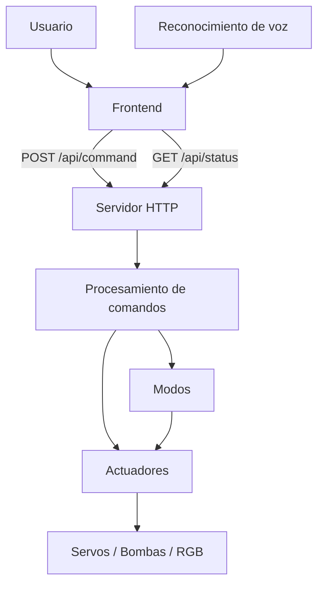

# 🌿 Patio Inteligente con ESP32

Proyecto académico de automatización de un patio inteligente mediante **ESP32 + MicroPython**, con control desde una **interfaz web** por Wi‑Fi y una capa adicional de **reconocimiento de voz en el navegador**.

El sistema controla una puerta, una silla orientable, una fuente, una regadera e iluminación RGB. También incluye modos automáticos que combinan varios actuadores.

## ⚙️ Funcionalidades

- 🚪 Puerta inteligente mediante servomotor.
- 🪑 Silla orientable: izquierda, centro y derecha.
- ⛲ Fuente de agua mediante bomba.
- 🌱 Regadera con apagado automático aproximado de 5 s.
- 🌈 Iluminación RGB por PWM.
- 🎛️ Modos noche, relajación, fiesta y salida.
- 🌐 Control desde navegador mediante Wi‑Fi.
- 🎙️ Reconocimiento de voz mediante Web Speech API cuando el navegador lo permite.

## 🧩 Arquitectura modular

El proyecto fue organizado aplicando **separación de responsabilidades**. Cada archivo se encarga de una parte concreta del sistema, evitando concentrar toda la lógica en `main.py` o `index.html`.



## 📁 Estructura del repositorio

```text
Patio-Inteligente-ESP32/
│
├── main.py              # Punto de entrada del sistema
├── config.py            # Wi-Fi, GPIO y constantes generales
├── estado.py            # Estado compartido del patio
├── actuadores.py        # Servos, bombas, RGB y temporizaciones
├── modos.py             # Escenas automáticas
├── comandos.py          # Normalización y despacho de comandos
├── red.py               # Wi-Fi y modo Access Point
├── servidor.py          # Servidor HTTP, API y archivos frontend
│
├── frontend/
│   ├── index.html       # Estructura visual
│   ├── styles.css       # Diseño y estilos
│   ├── api.js           # Comunicación HTTP con el ESP32
│   ├── voice.js         # Reconocimiento e interpretación de voz
│   └── app.js           # Eventos, estados y coordinación del frontend
│
├── evidencias/
│   └── ...
│
├── diagram.json         # Simulación de Wokwi
└── README.md
```

## 🖥️ Frontend: explicación de `index.html`

El frontend ya no está concentrado en un único archivo. Se separó en **HTML, CSS y JavaScript modular** para facilitar mantenimiento y correcciones.

### `frontend/index.html`

Contiene únicamente la **estructura de la interfaz**: tarjetas, botones, indicadores, panel de estado y controles de voz. No contiene la lógica del ESP32 ni grandes bloques de CSS o JavaScript.

El archivo carga los módulos externos:

```html
<link rel="stylesheet" href="styles.css">
<script src="api.js" defer></script>
<script src="voice.js" defer></script>
<script src="app.js" defer></script>
```

### `frontend/styles.css`

Contiene toda la presentación visual de la página: distribución responsive, tarjetas, botones, colores, animaciones e indicadores.

### `frontend/api.js`

Se encarga exclusivamente de la comunicación HTTP con el ESP32.

- `POST /api/command` → envía una orden.
- `GET /api/status` → consulta el estado actual.

Ejemplo de comando enviado:

```json
{
  "command": "abrir puerta"
}
```

### `frontend/voice.js`

Contiene únicamente la parte de voz. Utiliza:

```javascript
window.SpeechRecognition || window.webkitSpeechRecognition
```

El navegador convierte la voz a texto y el módulo interpreta frases naturales para transformarlas en comandos estándar como:

```text
"abre la puerta" → "abrir puerta"
```

El ESP32 no procesa audio; recibe únicamente el comando de texto.

### `frontend/app.js`

Es el coordinador del frontend. Maneja:

- eventos de los botones;
- actualización visual de estados;
- temporizador visual de la regadera;
- conexión entre `voice.js` y `api.js`;
- consulta periódica de `/api/status`.

## 🐍 Backend MicroPython

### `main.py`

Es el punto de entrada. Su responsabilidad se redujo a:

1. inicializar el hardware;
2. iniciar la red;
3. iniciar el servidor HTTP;
4. mantener el ciclo principal.

### `config.py`

Centraliza parámetros que pueden cambiar sin modificar la lógica del programa:

- credenciales Wi‑Fi;
- GPIO;
- posiciones de los servos;
- tiempos de riego y modo fiesta;
- configuración de bombas y RGB.

### `estado.py`

Mantiene un único diccionario compartido con el estado actual:

```python
estado = {
    "puerta": "cerrada",
    "silla": "centro",
    "fuente": False,
    "riego": False,
    "color": "apagado",
    "modo": "normal"
}
```

### `actuadores.py`

Controla directamente el hardware:

- PWM de servomotores;
- bombas;
- iluminación RGB;
- temporización no bloqueante del riego;
- secuencia RGB del modo fiesta.

### `modos.py`

Agrupa acciones de varios actuadores para crear las escenas automáticas.

### `comandos.py`

Centraliza el despacho de órdenes mediante `procesar_comando()`.

Ejemplo:

```text
"abrir puerta"
      ↓
procesar_comando()
      ↓
actuadores.abrir_puerta()
```

### `red.py`

Gestiona la conexión a una red Wi‑Fi y, si falla, puede crear el punto de acceso local `PatioInteligente`.

### `servidor.py`

Implementa el servidor HTTP del ESP32. Sirve los archivos de `frontend/` y expone la API utilizada por JavaScript.

## 🔌 Pines

| Elemento | GPIO |
|---|---:|
| Servo puerta | 13 |
| Servo silla | 14 |
| Bomba fuente | 25 |
| Bomba regadera | 26 |
| RGB rojo | 18 |
| RGB verde | 19 |
| RGB azul | 21 |

> Las bombas no deben conectarse directamente a los GPIO del ESP32. Deben utilizar una etapa de potencia adecuada y compartir GND con el sistema.

## 🌐 Flujo de una orden

```text
Botón o voz
    ↓
frontend/app.js
    ↓
frontend/api.js
    ↓
POST /api/command
    ↓
servidor.py
    ↓
comandos.py
    ↓
actuadores.py / modos.py
    ↓
Hardware
```

Tanto los botones como la voz terminan utilizando **el mismo camino de ejecución**, evitando duplicar lógica.

## 📊 Actualización del estado

La interfaz consulta periódicamente:

```http
GET /api/status
```

El ESP32 responde en JSON y `app.js` actualiza los indicadores de puerta, silla, fuente, riego, iluminación y modo.

## 📡 Configuración Wi‑Fi

Editar en `config.py`:

```python
WIFI_SSID = "NOMBRE_DE_LA_RED"
WIFI_PASSWORD = "CONTRASEÑA"
```

Si no puede conectarse y `USAR_AP_SI_FALLA` está activo, el ESP32 crea una red propia.

## 💾 Archivos que deben cargarse al ESP32

En la memoria del ESP32 se deben conservar los módulos Python en la raíz y la carpeta `frontend/` completa:

```text
/
├── main.py
├── config.py
├── estado.py
├── actuadores.py
├── modos.py
├── comandos.py
├── red.py
├── servidor.py
└── frontend/
    ├── index.html
    ├── styles.css
    ├── api.js
    ├── voice.js
    └── app.js
```

`main.py` se ejecuta como punto de entrada y `servidor.py` entrega al navegador los archivos almacenados en `frontend/`.

## 🧪 Simulación

La lógica inicial de actuadores fue comprobada en Wokwi utilizando dos servomotores, un RGB y dos LEDs como representación lógica de las bombas. El archivo `diagram.json` conserva el montaje de simulación.

## 🛠️ Tecnologías

- ESP32
- MicroPython
- HTML5
- CSS3
- JavaScript
- Fetch API / HTTP
- Web Speech API
- JSON
- Wokwi
- GitHub
